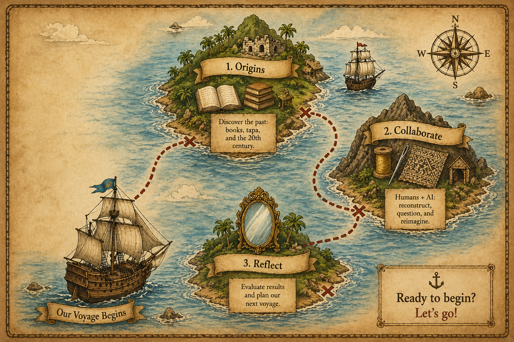
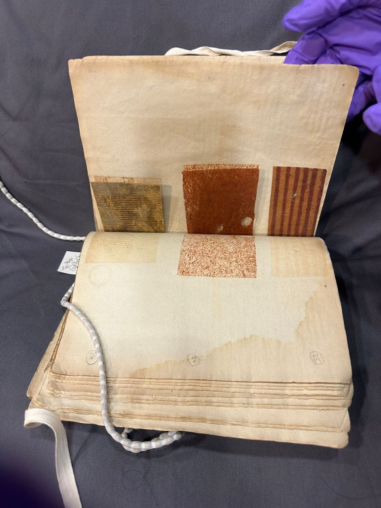
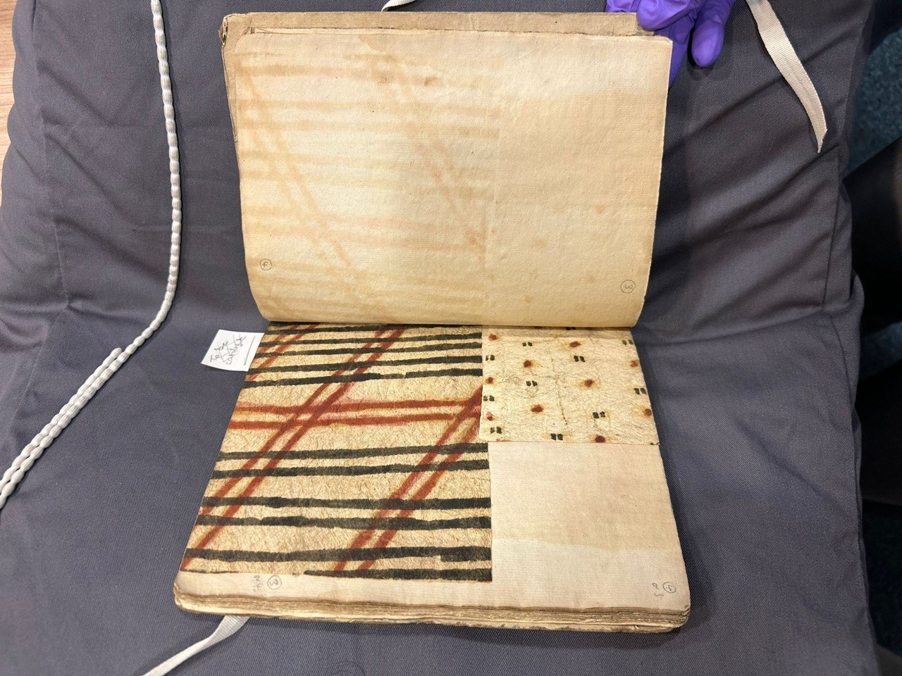
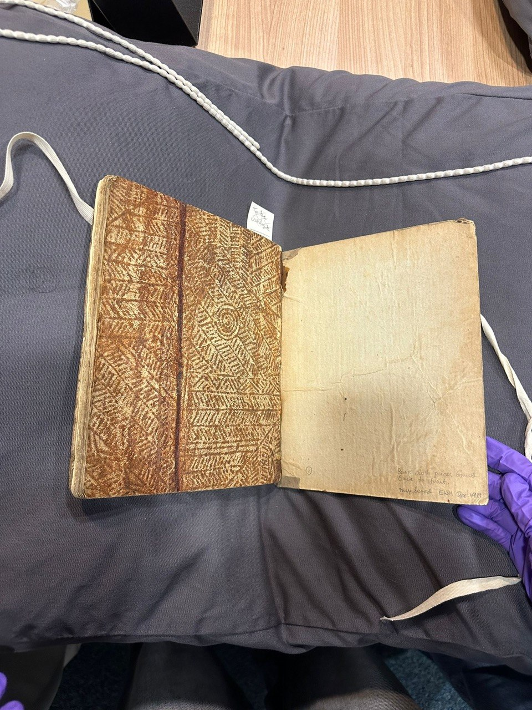

<h1>Rewoven: </h1><h3><em>A Catalogue of the Different Specimens of Cloth collected in the three voyages of Captain Cook to the Southern Hemisphere</em></h3>

---

Upon my visit to the University of Glasgow's Archives and Special collections, it is clear how precious the items were. Operating on strict terms, there is no bags or pens allowed. Only gloved and washed hands are granted supervised access to the fragile and irreplaceable objects. 
 At first glance, the catalogue reminded me of an old book read one too many times with pages spilling out from the cracked spine. Opening it was unexpectedly striking as every page contains real tapa cloth. Not images, not descriptions, but actual fabric cut out mostly into squares and bound into the pages. The book dates back to 1787, and as I tenderly flipped the pages of well-preserved fabrics, I felt an immediate and visceral connection to the past that a photograph simply could not replicate. 
 Yet that connection raised questions. Who made each piece? Where is it from? What do the patterns mean? Why did Captain Cook have these? What was it intended to be used for? Shaw's meticulous record of these tapa clothes were evidence of the civilisation that Captain Cook encountered during his voyage. Despite preservation attempts, key contextual information remains missing and the human stories behind these cloths have largely been lost. 
 This project sets out to investigate the cultural provenance of these tapa cloth samples and to use generative AI, specifically image generation tool DALL-E and large language model Microsoft Co-pilot, to speculatively reconstruct the missing narratives. By making visible the makers and meanings that the colonial catalogue could not record, I aim to invite a general audience to question how the circumstances of collection have shaped what we know, and don't know, about Pacific material culture and its relationship to contemporary textile practice. 
 So join me on this journey as we discover the secrets of the tapa cloths!

<h4>All aboard!</h4>

<h6><em>Generated by Chat-GPT</em></h6>

<em>Before proceeding, let's take a look at our map for this voyage...</em> 
 First, we will set sail towards the land of "Once upon a time..." as we travel back in time to discover the history of the book, the origins of the tapa clothes, and learn more about the 20th century era. Our second stop is THE gold mine "Needle and Thread", where we understand how humans and AI can work together to reconstruct context, question colonial narratives, and reimagine how we engage with fragile cultural heritage. Finally, we drop our anchor at "Mirror mirror on the wall" to reflect and evaluate the results of the collaboration and what it could improve on to help us in our next voyage. 
 Are you ready? Let's begin!

  
<h2>Part I - Once upon a time...</h2>

  Click to find out more!
  
  

    
<h3>The Voyages</h3>

    Between 1768 and 1780, Captain James Cook made three voyages into the Pacific on behalf of the   British Crown. 
 <strong>The first voyage (1768–1771)</strong> began as a scientific mission to Tahiti to observe the transit of Venus, commissioned jointly by the Royal Society and the Admiralty under King George III. At the same time, Cook was also in posession of a second set of secret instructions which he was instructed to open after observing the transit. Labelled 'Secret', these instructions told him to travel southward in search of a large, undiscovered continent believed to lie in the South Pacific, also known as <em>Terra Australis Incognita</em>. Upon exploration, he did not discover the continent. Instead, it gave botanists Joseph Banks and Daniel Solander the opportunity to collect plants from previously unexplored habitats. Meanwhile, Cook began mapping the relatively unknown regions of New Zealand and the easter coast of Australia. Some territories were then claimed for Britain without the consent of the local inhabitants.

 <strong>The second voyage (1772–1775)</strong> used two ships, HMS Resolution (captained by Cook), and HMS Adventure (captained by Tobias Furneaux). This was a precaution warranted by the endeavour's near destruction on the Great Barrier Reef during the first voyage. The aim was to push further south than any European ship had before and definitively resolve whether <em>Terra Australis</em> existed. Johann Reinhold Forster and his son Georg were given the role of <em>'Scientific Gentlemen'</em> aboard the Resolution, the same Forster whose observations Shaw would later draw on for the catalogue's text. During this expedition, Cook visited Easter Island, the Marquesas, and Tonga, and discovered New Caledonia. Objects were collected at each stop with some  traded and some gifted but records are not always clear on which was which.

<strong>The third and final voyage (1776–1779)</strong> aimed to find the elusive Northwest Passage between the Pacific and Atlantic Oceans. Sailing via New Zealand and Tahiti, they reached Hawaii on 18 January 1778, becoming the first Europeans to do so. They then sailed up the west coast of America, preparing the first charts of this coastline. Tragically, Cook never made it home. A dispute arose over a stolen boat, and in a melee on 14 February 1779, Cook was attacked and killed along with four marines. When HMS Discovery finally returned to London in 1780, it carried his absence and his collection. Among the artifacts were many rolls of tapa cloth, which eventually became the catalogue sitting in front of me.

[The National Archives,UK](https://www.nationalarchives.gov.uk/education/resources/the-search-for-terra-australis/) 
[First Voyage of Captain James Cook](https://naturalhistory.si.edu/research/botany/about/historical-expeditions/first-voyage-captain-james-cook)
[National Museum of Australia](https://www.nma.gov.au/exhibitions/exploration-and-endeavour/cooks-voyages-pacific) 
[Penn Museum] 
[The Royal Geographical Society Of South Australia](https://rgssa.org.au/heritage/treasures/james-cooks-third-voyage-to-the-pacific-ocean) 
[University of Michigan](https://clements.umich.edu/staff-favorite-tapa-cloth-from-captain-cooks-voyages/) 
  

  
  

    
<h3>The Catalogue</h3>

    Alexander Shaw was a London-based bookseller and dealer in natural history artifacts, operating from 379 Strand. Seven years after Cook's final voyage returned in 1787,  he published <em>A Catalogue of the Different Specimens of Cloth Collected in the Three Voyages of Captain Cook to the Southern Hemisphere</em>. Shaw is believed to have acquired the tapa samples at the 1781 sale of David Samwell, the surgeon's mate aboard Cook's third voyage.  

An unusual publication, the catalogue is a bound volume containing square cutout samples of the physical tapa cloth alongside 8 pages of description. Because every copy was assembled by hand, no two are identical. A 2015 census identified 66 different surviving copies held in institutions across the world. wordpress The University of Glasgow's copy, catalogued as <em>Sp Coll Hunterian K.5.22</em>, contains 37 samples and was donated to the Hunterian Museum Library in 1877 by William Lee, the University's Professor of Ecclesiastical History. 

Shaw's text draws partly on observations from naturalists Anderson and Reinhold Forster, and partly on the verbal accounts of other navigators. A printed note confirms he also sold additional tapa samples from his Strand shop alongside the catalogue which implies that it may have been a means of cashing in on his earlier acquisition. 

[Alexander Shaw's curious cloth catalogue](https://universityofglasgowlibrary.wordpress.com/2015/11/26/alexander-shaws-curious-cloth-catalogue/) 
[University of Pennsylvania](https://openn.library.upenn.edu/Data/0016/html/87-3-1.html) 
  

  

    
<h3>The Cloth</h3>

    Tapa cloth is made in the islands of the Pacific Ocean, primarily in Tonga, Samoa, and Fiji. Similarly, places like Niue, the Cook Islands, the Solomon Islands, New Zealand, Vanuatu, Papua New Guinea, and Hawaii also produce such cloths where it is instead known as kapa. Each region produces its own distinct style. The varieties collected from these islands were vast and included fine gauzes from Tahiti, robust waterproof samples from Tonga, and pieces bearing patterns like watermarks, made with carved beaters from Hawaii.  

The making of these Polynesian cloths starts by stripping a bark from a tree and seperating the inner layer from the outer one. The inner bark is then pounded with wooden beaters to spread the fibres into a thin sheet. Primarily created by women using inherited clan designs, the manufacture of barkcloth formed a major vehicle for both creative expression and social cohesion, maintaining and communicating the artists' deep connection to their ancestors and country. 

The locations represented in Shaw's catalogue are mainly Tahiti, Mo'orea, Raiatea, Bora Bora, Huahine, New Zealand, Easter Island, the Marquesas Islands, Fiji, Tonga, and Hawaii (Wilson, L.,2003). Precise origins for individual samples are, in most cases, unknown.

[World Intellectual Property Organisation](https://www.wipo.int/en/web/ip-advantage/w/stories/tapa-cloth-an-ancient-fijian-craft-revisited-by-creations-23)
 [Penn Museum](https://www.penn.museum/sites/expedition/captain-cooks-barkcloth-books/)
 [RSID Museum](https://risdmuseum.org/exhibitions-events/exhibitions/cloth-without-weaving)
 [University of Cambridge](https://www.repository.cam.ac.uk/items/c9d5d370-2bfe-4529-a088-1aa3f0485a7f)
  

  

    
<h3>The Gap</h3>

    Shaw's catalogue records what the cloth looks like. But what it fails to record is who made each piece, what the patterns signified, or what it meant to the people it belonged to before it was collected. There is a huge amount of lost knowledge about the kinds of trees used, dyes, and the range of oils and resins used to prepare surfaces. During the eighteenth and nineteenth centuries, tapa constituted everyday clothing, a wrapping for spiritually powerful artifacts, a marker of identity and status, and a storable commodity analogous to currency, none of which was captured in Shaw's numbered list.  

Sadly, this is not unusual for the period. Colonial collecting practices across the 18th century routinely excluded maker voices, prioritised European classification systems, and treated material culture as specimen rather than story. The result is a fragmentary archive where the objects survived, but the context around them was either never recorded or has since been lost.
The tapa samples in this catalogue are two and a half centuries old. They are still vivid, still textured, still present.

[Mills, A. (2018)](https://www.tandfonline.com/doi/full/10.1080/17458927.2018.1516025) 
[Kew](https://www.kew.org/read-and-watch/unpacking-tapa) 
  

All is not lost as we might find the solution we seek in modern day technologies. Find out more in our next stop!

  
<h2>Part II - Needle and thread</h2>

  <h3>Methodology</h3>

<strong>Step 1 - Identifying the Gap</strong> 
After my visit to the Special Collections and researching Shaw's catalogue, it was clear that the most significant thing missing was context, both visual and text. Yes, the cloth survived. But everything else did not. From the people who made it to the ceremonies it was part of and the communities it came from, none of that was captured. Shaw recorded what the cloth looked like but not what it meant.

I kept coming back to the same question: What secrets are these cloiths holding that could be of relevance to modern day textile industry? That question couldn't be answered through research alone. I needed a tool that could generate something that no archive could supply, a way of making absence visible rather than just describing it. But I also needed a way of interrogating the results produced, separating from my own assumptions. That led me to two tools used in sequence: DALL-E 3 to generate, and Microsoft Copilot to interpret.

<strong>Step 2 - Choosing DALL-E 2</strong> 
The gap I was trying to address was both visual and contextual, and so a generative image model felt like the most direct way in. DALL-E 2 is a text-to-image generation model developed by OpenAI. Given a written prompt, it generates an original image from scratch. That meant that I could describe cultural contexts that no photograph exists of and receive a speculative visual reconstruction of them in return.What appealed to me about this tool specifically was that it is generative rather than analytical. I wasn't trying to describe the cloth that already exists in the archive. I was trying to imagine what surrounded it before it was cut up and stitched into a collector's book. DALL-E 2 gave me a way to ask questions like who made it and what it was for, visually rather than just in writing. 

<strong>Step 3 - Designing the Dall-E prompts</strong> 
> Full prompt log including all original prompts, DALL-E outputs, and follow-up prompts available in [ai-for-the-arts-B](ai_generator.ipynb)

Before I can start using the AI tools, prior research about the University of Glasgow's copy of Shaw's catalogue showed that it has yet to be digitised. Therefore, during my visit, I was able to capture a few videos and pictures. Sifting through them, I narrowed down to 4 clear shots of the samples, each with different sizes, colours, and patterns.

When uploading the samples to Dall-E, I experimented with both the prompts and the samples. Because it was of varying degrees of sizes, the samples yielded differing results, each with its own interpretation. Formation and analysing of the prompts and outputs were not something AI could sit and reflect about on its own without my intervention. However, minor tweaks proved to be helpful as I was able to find the right direction in which AI was able to produce an image of what the cloth samples could have looked liked before being cut up and preserved in the book. 

<strong>Step 4 - Analysing the outputs</strong>

<h6><em>From left to right, Sample 1 to 3</em></h6>

Before submitting any prompts, I worked with the tapa sample images from the catalogue directly. Looking at them together, a pattern emerged immediately: the size of the cloth sample varies significantly across the pages, starting small in the first samples and becoming the largest in the final ones. This mattered more than I initially expected.

When I began inputting the samples into DALL-E, it became clear that a bigger sample produced a more workable output. Smaller samples gave the model too little to work with where the generated images were vague, the patterns indistinct. A larger sample gave DALL-E more visual information to extrapolate from, producing reconstructions that felt closer to what a full piece of cloth might have looked like. At the same time, DALL-E had a consistent tendency to factor in the surrounding page when generating the images like treating the aged paper, the stitching, and the catalogue format as part of the image rather than background noise. Together, these two quirks gave me the direction I needed to design my prompts more deliberately: specifying the cloth in isolation, choosing bigger samples, and explicitly framing what I wanted the model to reconstruct rather than reproduce.

DALL-E's interpretation of each sample was also shaped by the size and texture it was presented with. This raised a complication I hadn't fully anticipated. A larger sample could reasonably suggest a larger original piece of cloth, but it could equally have come from a patchwork, a composite piece, or a section of something much more varied. The model had no way of knowing which. And crucially, neither did I.

This is where the limits of the exercise became most visible. Indigenous communities do not always have access to the internet, and many choose not to digitise their textile traditions, a decision that deserves respect rather than a workaround. The knowledge needed to accurately interpret these samples is not in any archive Shaw had access to, and it is not in DALL-E's training data either. Beyond that, the natural variation in bark and tree species used to make tapa means that each piece is inherently unique, the same technique applied to different raw materials produces different textures, weights, and surface patterns. No model trained on generalised image data can reliably account for that specificity. What DALL-E produced, then, was not a reconstruction of what these cloths originally were. It was a reconstruction of what a Western-trained AI imagines they might have been, based on the visual information I gave it. 

To bring this further, Microsoft Co-pilot played the role of a historian and fellow scholar, allowing me to take an extrapolated image generated from these samples and add context to it. The results would then discuss the history of these tapa cloths, Cook's possible experience at the time of voyage, and the relationship of the Pacific region and modern textile industry. 

<strong>Step 5 - Choosing Microsoft Co-pilot</strong>  
Copilot is a large language model developed by Microsoft, built on OpenAI's GPT architecture, and capable of receiving images as inputs and producing detailed written responses about them. I used it purely as an interpreter and not to generate anything new, but rather to analyse what DALL-E had already produced. The aim was to see what a second AI system, with abit of context but no prior knowledge of the original sample, would make of the same images I had been staring at.

<strong>Step 6 - Designing the Co-pilot prompts</strong>  
> Full prompt log including all original prompts, DALL-E outputs, and follow-up prompts available in [ai-for-the-arts-B](ai_interpreter.ipynb)

<strong>Step 7 - Creating a final product in Dall-E

<h2>Part III - Mirror mirror on the wall</h2>
<h2>Bibliography</h2>
